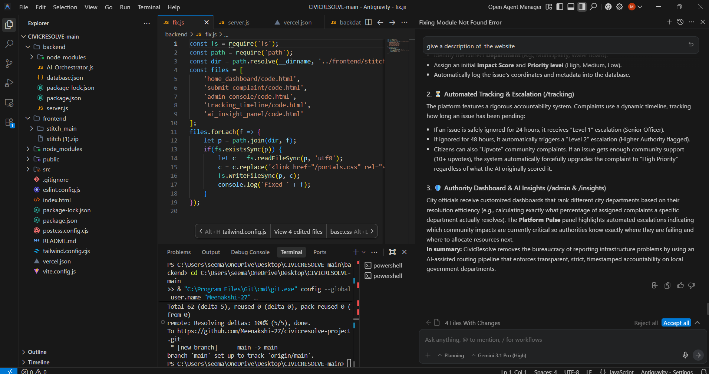
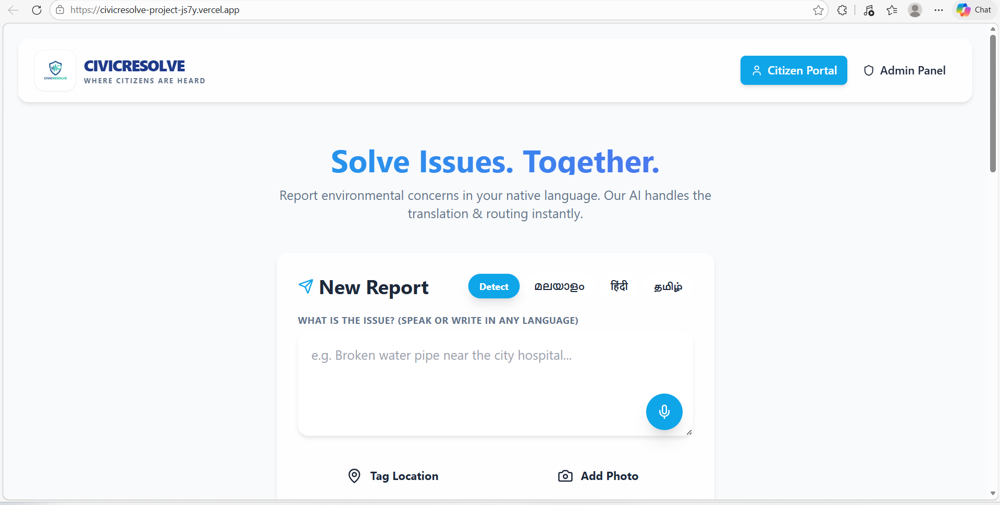
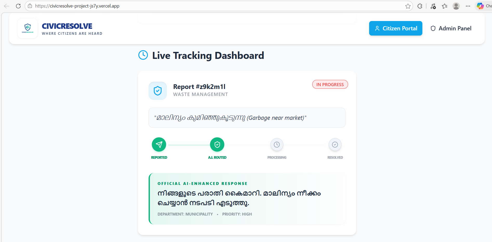
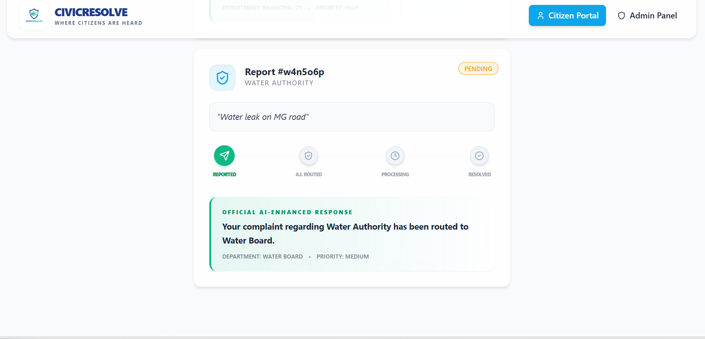
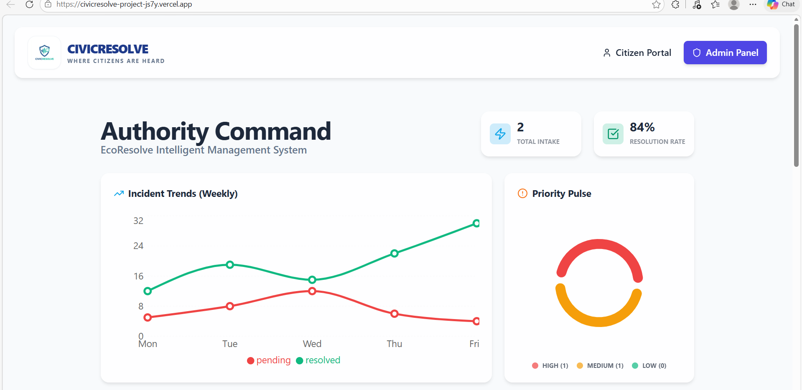
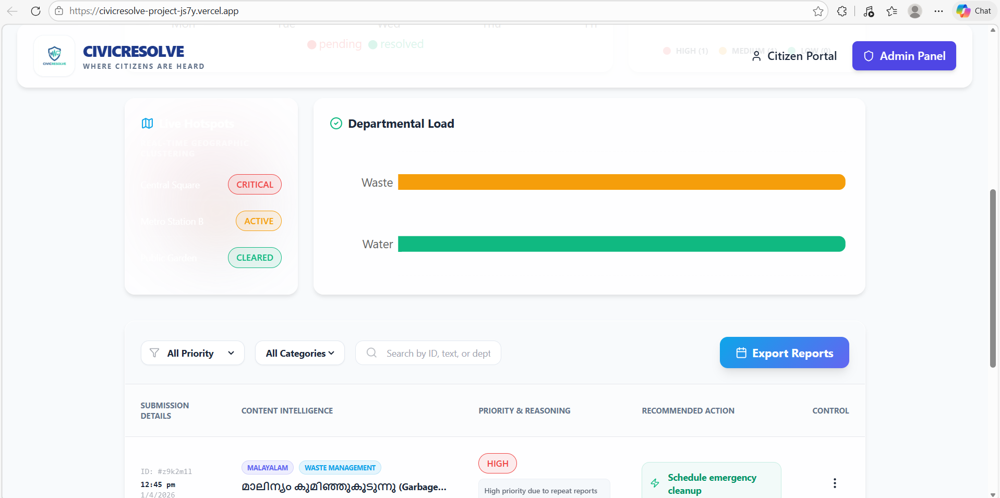
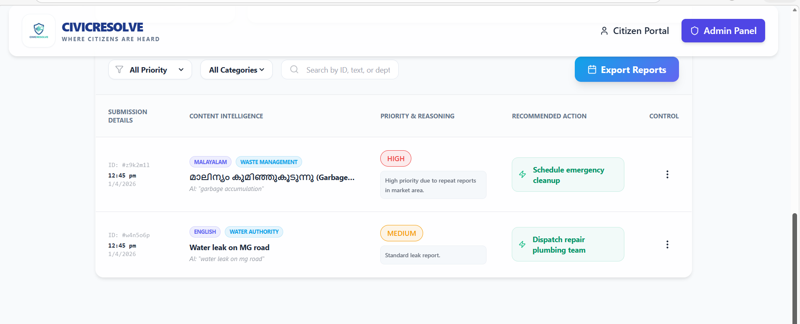

 Problem Statement

“Citizens face difficulties in reporting environmental issues due to language barriers, complex systems, and lack of transparency, leading to delayed or unresolved complaints.”

 Project Description

“CivicResolve is an AI-powered platform that enables users to report environmental issues through voice and multilingual input, automatically categorizes and prioritizes complaints, and ensures timely resolution with tracking and alert mechanisms

Google AI Usage

Tools / Models Used

Google Gemini API

Natural Language Processing (NLP)

Multilingual Translation AI

How Google AI Was Used

Translates complaints from multiple languages

Classifies issues (waste, water, pollution, etc.)

Generates summaries for authorities

Provides smart suggestions to users

Proof of Google AI Usage

Screenshots

Demo Video

https://drive.google.com/file/d/1NWuV3Ce-1SKId0UFjwjv6J9PuCLukOe0/view?usp=sharing

Watch Demo

Tech Stack

React + Vite

Node.js

Express

MongoDB

Features

Multilingual complaint system

AI-based issue classification

Real-time tracking

Admin dashboard

Smart alerts

✔ Add badges (GitHub stars, license, etc.)
✔ Improve it for hackathon judging (high score)
